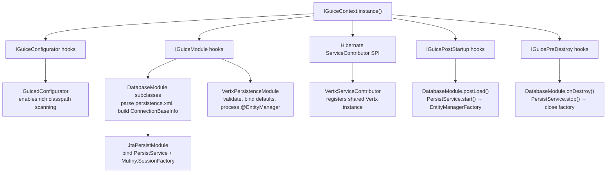
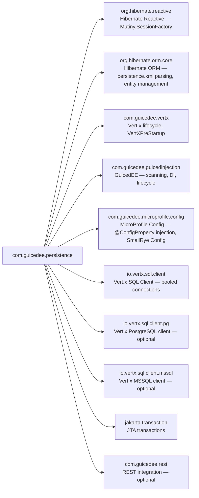

# GuicedEE Persistence

[](https://github.com/GuicedEE/GuicedVertxPersistence/actions/workflows/build.yml)
[](https://central.sonatype.com/artifact/com.guicedee/persistence)
[](https://www.apache.org/licenses/LICENSE-2.0)


Reactive **JPA persistence** for [GuicedEE](https://github.com/GuicedEE) applications using **Hibernate Reactive 7** and **Vert.x 5**.
Extend `DatabaseModule`, point it at a `persistence.xml` unit, and the module wires a `Mutiny.SessionFactory` into Guice — fully reactive, annotation-driven, with built-in support for PostgreSQL, MySQL, SQL Server, Oracle, and DB2.

Built on [Hibernate Reactive](https://hibernate.org/reactive/) · [Vert.x SQL Client](https://vertx.io/docs/vertx-sql-client/java/) · [Google Guice](https://github.com/google/guice) · [Mutiny](https://smallrye.io/smallrye-mutiny/) · JPMS module `com.guicedee.persistence` · Java 25+

## 📦 Installation

```xml
<dependency>
  <groupId>com.guicedee</groupId>
  <artifactId>persistence</artifactId>
</dependency>
```

<details>
<summary>Gradle (Kotlin DSL)</summary>

```kotlin
implementation("com.guicedee:persistence:2.0.2-SNAPSHOT")
```
</details>

## ✨ Features

- **Annotation-driven persistence units** — extend `DatabaseModule`, annotate with `@EntityManager`, and Guice wires everything from `persistence.xml`
- **Hibernate Reactive + Mutiny** — `Mutiny.SessionFactory` is bound in Guice with full reactive session/transaction support
- **Multi-database support** — built-in `ConnectionBaseInfo` implementations for PostgreSQL, MySQL, SQL Server, Oracle, and DB2
- **Environment variable resolution** — `${VAR_NAME}` placeholders in `persistence.xml` properties are resolved from system properties or environment variables
- **Vert.x SQL Client pooling** — pre-initialized shared connection pools on the Vert.x event loop for optimal Hibernate Reactive integration
- **Multiple persistence units** — bind multiple `DatabaseModule` subclasses with distinct `@Named` qualifiers; one is marked as the default
- **`@EntityManager` scoping** — annotate packages or classes to associate entities with specific persistence units
- **SPI-driven property processing** — `IPropertiesEntityManagerReader` and `IPropertiesConnectionInfoReader` contribute database-specific Hibernate settings
- **Vert.x context-aware startup** — `EntityManagerFactory` creation runs on a proper Vert.x context to satisfy Hibernate Reactive's internal requirements
- **Lifecycle management** — `PersistService.start()` / `stop()` integrated with `IGuicePostStartup` / `IGuicePreDestroy`

## 🚀 Quick Start

**Step 1** — Add a `persistence.xml`:

```xml
<!-- src/main/resources/META-INF/persistence.xml -->
<persistence xmlns="https://jakarta.ee/xml/ns/persistence" version="3.0">
  <persistence-unit name="mydb">
    <provider>org.hibernate.reactive.provider.ReactivePersistenceProvider</provider>
    <class>com.example.entities.User</class>
    <properties>
      <property name="jakarta.persistence.jdbc.url"
                value="${DB_URL:jdbc:postgresql://localhost:5432/mydb}"/>
      <property name="jakarta.persistence.jdbc.user" value="${DB_USER:postgres}"/>
      <property name="jakarta.persistence.jdbc.password" value="${DB_PASSWORD:secret}"/>
      <property name="hibernate.hbm2ddl.auto" value="update"/>
    </properties>
  </persistence-unit>
</persistence>
```

**Step 2** — Create a `DatabaseModule` subclass:

```java
public class MyDatabaseModule extends DatabaseModule<MyDatabaseModule> {

    @Override
    protected String getPersistenceUnitName() {
        return "mydb";
    }

    @Override
    protected ConnectionBaseInfo getConnectionBaseInfo(
            PersistenceUnitDescriptor unit, Properties properties) {
        return ConnectionBaseInfoFactory.createConnectionBaseInfo("postgresql");
    }
}
```

**Step 3** — Register via JPMS:

```java
module my.app {
    requires com.guicedee.persistence;

    provides com.guicedee.client.services.lifecycle.IGuiceModule
        with my.app.MyDatabaseModule;
}
```

**Step 4** — Use the reactive session factory:

```java
public class UserService {

    @Inject
    private Mutiny.SessionFactory sessionFactory;

    public Uni<User> createUser(String name) {
        User user = new User();
        user.setName(name);
        return sessionFactory.withTransaction(session ->
            session.persist(user).replaceWith(user)
        );
    }

    public Uni<User> findUser(Long id) {
        return sessionFactory.withSession(session ->
            session.find(User.class, id)
        );
    }
}
```

## 📐 Architecture

```mermaid
flowchart TD
    n1["Startup"]
    n2["IGuiceContext.instance()"]
    n1 --> n2
    n3["IGuiceConfigurator hooks"]
    n2 --> n3
    n4["GuicedConfigurator<br/>enables annotation, field, method scanning"]
    n3 --> n4
    n5["IGuiceModule hooks"]
    n2 --> n5
    n6["MyDatabaseModule<br/>extends DatabaseModule"]
    n5 --> n6
    n7["Parse persistence.xml<br/>PersistenceXmlParser"]
    n6 --> n7
    n8["IPropertiesEntityManagerReader SPIs"]
    n6 --> n8
    n9["SystemEnvironmentVariablesPropertiesReader<br/>${VAR} resolution"]
    n6 --> n9
    n10["HibernateEntityManagerProperties"]
    n6 --> n10
    n11["PostgresHibernateProperties / MySql... / Oracle... / SqlServer... / DB2..."]
    n6 --> n11
    n12["IPropertiesConnectionInfoReader SPIs"]
    n6 --> n12
    n13["HibernateDefaultConnectionBaseBuilder<br/>maps jakarta.persistence.jdbc.*"]
    n6 --> n13
    n14["ConnectionBaseInfo.populateFromProperties()"]
    n6 --> n14
    n15["ConnectionBaseInfo.toPooledDatasource()<br/>Vert.x SQL pool init"]
    n6 --> n15
    n16["JtaPersistModule"]
    n6 --> n16
    n17["bind PersistService @Named('mydb')"]
    n16 --> n17
    n18["bind Mutiny.SessionFactory @Named('mydb') + default"]
    n16 --> n18
    n19["VertxPersistenceModule"]
    n5 --> n19
    n20["Validate @EntityManager annotations"]
    n19 --> n20
    n21["Process package-level @EntityManager"]
    n19 --> n21
    n22["Bind default EntityManager / SessionFactory"]
    n19 --> n22
    n23["IGuicePostStartup hooks"]
    n2 --> n23
    n24["DatabaseModule.postLoad()"]
    n23 --> n24
    n25["PersistService.start()<br/>creates EntityManagerFactory on Vert.x context"]
    n24 --> n25
    n26["IGuicePreDestroy hooks"]
    n2 --> n26
    n27["DatabaseModule.onDestroy()"]
    n26 --> n27
    n28["PersistService.stop()<br/>closes SessionFactory + EntityManagerFactory"]
    n27 --> n28
```



### Hibernate Reactive integration

```
Hibernate Reactive
 └─ ServiceContributor SPI
     └─ VertxServiceContributor
         └─ Registers VertxInstance backed by VertXPreStartup.getVertx()
             → Hibernate Reactive uses the shared Vert.x instance for all reactive IO
```

## 🗃️ Database Module

### Extending `DatabaseModule`

Every persistence unit is represented by a `DatabaseModule` subclass annotated with `@EntityManager`:

```java
public class OrdersDatabaseModule extends DatabaseModule<OrdersDatabaseModule> {

    @Override
    protected String getPersistenceUnitName() {
        return "orders";
    }

    @Override
    protected ConnectionBaseInfo getConnectionBaseInfo(
            PersistenceUnitDescriptor unit, Properties properties) {
        return ConnectionBaseInfoFactory.createConnectionBaseInfo("postgresql");
    }

    @Override
    public Integer sortOrder() {
        return 50; // controls startup ordering
    }
}
```

### `@EntityManager` annotation

| Attribute | Default | Purpose |
|---|---|---|
| `value` | `""` | Persistence unit name (maps to `persistence.xml`) |
| `allClasses` | `true` | Include all entity classes or only the annotated package |
| `defaultEm` | `true` | Mark as the default `SessionFactory` binding |

Apply at **class level** (on `DatabaseModule` subclasses) or **package level** (`package-info.java`) to scope entities to specific persistence units.

## 🔌 Connection Configuration

### `ConnectionBaseInfo`

Abstract base class carrying all JDBC connection properties. Database-specific subclasses provide the `toPooledDatasource()` method that creates a Vert.x `SqlClient` pool.

### `ConnectionBaseInfoFactory`

Creates the correct `ConnectionBaseInfo` for a given database type:

```java
// By database name
ConnectionBaseInfo cbi = ConnectionBaseInfoFactory.createConnectionBaseInfo("postgresql");

// By JDBC URL (auto-detects database type)
ConnectionBaseInfo cbi = ConnectionBaseInfoFactory.createConnectionBaseInfoFromJdbcUrl(
    "jdbc:postgresql://localhost:5432/mydb");
```

### Supported databases

| Database | Type string | `ConnectionBaseInfo` class | Hibernate properties |
|---|---|---|---|
| PostgreSQL | `postgresql`, `postgres` | `PostgresConnectionBaseInfo` | `PostgresHibernateProperties` |
| MySQL / MariaDB | `mysql`, `mariadb` | `MySqlConnectionBaseInfo` | `MySqlHibernateProperties` |
| SQL Server | `sqlserver`, `mssql` | `SqlServerConnectionBaseInfo` | `SqlServerHibernateProperties` |
| Oracle | `oracle` | `OracleConnectionBaseInfo` | `OracleHibernateProperties` |
| DB2 | `db2` | `DB2ConnectionBaseInfo` | `DB2HibernateProperties` |

### Connection properties

| Property | Default | Purpose |
|---|---|---|
| `serverName` | — | Database server hostname |
| `port` | varies | Database server port |
| `databaseName` | — | Database / schema name |
| `username` | — | Authentication username |
| `password` | — | Authentication password |
| `minPoolSize` | `1` | Minimum connection pool size |
| `maxPoolSize` | `5` | Maximum connection pool size |
| `maxIdleTime` | — | Idle connection timeout (seconds) |
| `maxLifeTime` | — | Maximum connection lifetime (seconds) |
| `reactive` | `true` | Use Hibernate Reactive (vs. blocking) |
| `defaultConnection` | `true` | Register as the default binding |

## ⚙️ Configuration

### `persistence.xml` properties

Standard JPA/Jakarta persistence properties are supported:

| Property | Purpose |
|---|---|
| `jakarta.persistence.jdbc.url` | JDBC connection URL |
| `jakarta.persistence.jdbc.user` | Database username |
| `jakarta.persistence.jdbc.password` | Database password |
| `jakarta.persistence.jdbc.driver` | JDBC driver class |
| `hibernate.hbm2ddl.auto` | Schema management (`update`, `validate`, `create`, `create-drop`) |
| `hibernate.dialect` | Hibernate dialect (auto-set by database-specific readers) |

### Environment variable resolution

All `persistence.xml` property values support `${VAR_NAME}` and `${VAR_NAME:default}` syntax:

```xml
<property name="jakarta.persistence.jdbc.url"
          value="${DB_URL:jdbc:postgresql://localhost:5432/mydb}"/>
<property name="jakarta.persistence.jdbc.user"
          value="${DB_USER:postgres}"/>
<property name="jakarta.persistence.jdbc.password"
          value="${DB_PASSWORD}"/>
```

The `SystemEnvironmentVariablesPropertiesReader` resolves placeholders in this order:
1. System property (`-DDB_URL=...`)
2. Environment variable (`export DB_URL=...`)
3. Default value (after the `:` separator)

Kubernetes-friendly: dot-notation properties (e.g., `db.url`) are also tried as uppercase underscored (`DB_URL`).

## 🔌 SPI Extension Points

All SPIs are discovered via `ServiceLoader`. Register implementations with JPMS `provides...with` or `META-INF/services`.

### `IPropertiesEntityManagerReader`

Contributes database-specific Hibernate properties for a persistence unit:

```java
public class MyCustomProperties
        implements IPropertiesEntityManagerReader<MyCustomProperties> {

    @Override
    public boolean applicable(PersistenceUnitDescriptor pu) {
        return "mydb".equals(pu.getName());
    }

    @Override
    public Map<String, String> processProperties(
            PersistenceUnitDescriptor pu, Properties properties) {
        return Map.of("hibernate.jdbc.batch_size", "100");
    }
}
```

### `IPropertiesConnectionInfoReader`

Populates `ConnectionBaseInfo` from persistence unit properties:

```java
public class MyConnectionReader
        implements IPropertiesConnectionInfoReader<MyConnectionReader> {

    @Override
    public ConnectionBaseInfo populateConnectionBaseInfo(
            PersistenceUnitDescriptor unit, Properties props,
            ConnectionBaseInfo cbi) {
        cbi.setMaxPoolSize(20);
        return cbi;
    }
}
```

### SPI summary

| SPI | Purpose |
|---|---|
| `IPropertiesEntityManagerReader` | Contribute database-specific Hibernate properties |
| `IPropertiesConnectionInfoReader` | Populate `ConnectionBaseInfo` from persistence properties |
| `IGuiceConfigurator` | Configure classpath scanning (enabled by `GuicedConfigurator`) |
| `ServiceContributor` (Hibernate) | Bridge the Vert.x instance into Hibernate Reactive |

## 💉 Dependency Injection

### Available bindings

| Type | Qualifier | Scope | Purpose |
|---|---|---|---|
| `Mutiny.SessionFactory` | `@Named("puName")` | Singleton | Named session factory for a specific persistence unit |
| `Mutiny.SessionFactory` | *(none)* | Singleton | Default session factory (from `defaultEm = true`) |
| `PersistService` | `@Named("puName")` | Singleton | Lifecycle service (`start()` / `stop()`) |
| `PersistService` | *(none)* | Singleton | Default persistence service |

### Multiple persistence units

```java
public class MultiDbService {

    @Inject
    private Mutiny.SessionFactory defaultFactory;  // from defaultEm = true

    @Inject
    @Named("orders")
    private Mutiny.SessionFactory ordersFactory;   // specific PU

    @Inject
    @Named("analytics")
    private Mutiny.SessionFactory analyticsFactory; // another PU
}
```

### Using sessions

```java
// Read with a session
sessionFactory.withSession(session ->
    session.find(User.class, userId)
).subscribe().with(
    user -> log.info("Found: {}", user),
    err  -> log.error("Failed", err)
);

// Write inside a transaction
sessionFactory.withTransaction(session ->
    session.persist(newUser)
           .chain(() -> session.persist(newOrder))
).subscribe().with(
    v    -> log.info("Committed"),
    err  -> log.error("Rolled back", err)
);
```

## 🔀 Multi-Database Setup

### Step 1 — Define persistence units

```xml
<persistence>
  <persistence-unit name="users">
    <class>com.example.entities.User</class>
    <properties>
      <property name="jakarta.persistence.jdbc.url" value="${USERS_DB_URL}"/>
      ...
    </properties>
  </persistence-unit>
  <persistence-unit name="orders">
    <class>com.example.entities.Order</class>
    <properties>
      <property name="jakarta.persistence.jdbc.url" value="${ORDERS_DB_URL}"/>
      ...
    </properties>
  </persistence-unit>
</persistence>
```

### Step 2 — Create modules

```java
@EntityManager(value = "users", defaultEm = true)
public class UsersDatabaseModule extends DatabaseModule<UsersDatabaseModule> {
    @Override protected String getPersistenceUnitName() { return "users"; }
    @Override protected ConnectionBaseInfo getConnectionBaseInfo(
            PersistenceUnitDescriptor unit, Properties props) {
        return ConnectionBaseInfoFactory.createConnectionBaseInfo("postgresql");
    }
}

@EntityManager(value = "orders", defaultEm = false)
public class OrdersDatabaseModule extends DatabaseModule<OrdersDatabaseModule> {
    @Override protected String getPersistenceUnitName() { return "orders"; }
    @Override protected ConnectionBaseInfo getConnectionBaseInfo(
            PersistenceUnitDescriptor unit, Properties props) {
        return ConnectionBaseInfoFactory.createConnectionBaseInfo("mysql");
    }
}
```

### Step 3 — Scope entities via package annotation

```java
@EntityManager(value = "orders")
package com.example.entities.orders;

import com.guicedee.persistence.annotations.EntityManager;
```

## 🔄 Startup Flow



## 🗺️ Module Graph



## 🧩 JPMS

Module name: **`com.guicedee.persistence`**

The module:
- **exports** `com.guicedee.persistence`, `com.guicedee.persistence.annotations`, `com.guicedee.persistence.bind`, `com.guicedee.persistence.implementations`, and database-specific packages
- **provides** `IGuiceConfigurator` with `GuicedConfigurator`
- **provides** `IPropertiesEntityManagerReader` with `SystemEnvironmentVariablesPropertiesReader`, `HibernateEntityManagerProperties`, `PostgresHibernateProperties`, `MySqlHibernateProperties`, `OracleHibernateProperties`, `SqlServerHibernateProperties`, `DB2HibernateProperties`
- **provides** `IPropertiesConnectionInfoReader` with `HibernateDefaultConnectionBaseBuilder`
- **provides** `ServiceContributor` with `VertxServiceContributor`
- **uses** `IPropertiesConnectionInfoReader`, `IPropertiesEntityManagerReader`

In non-JPMS environments, `META-INF/services` discovery still works.

## 🏗️ Key Classes

| Class | Package | Role |
|---|---|---|
| `DatabaseModule` | `vertxpersistence` | Abstract Guice module — extend per persistence unit; lifecycle, config, and binding |
| `ConnectionBaseInfo` | `vertxpersistence` | Abstract connection configuration — host, port, credentials, pool settings |
| `ConnectionBaseInfoFactory` | `vertxpersistence` | Factory — creates database-specific `ConnectionBaseInfo` by type or JDBC URL |
| `ConnectionBaseInfoBuilder` | `vertxpersistence` | Maps `jakarta.persistence.jdbc.*` properties into `ConnectionBaseInfo` |
| `PersistService` | `vertxpersistence` | Interface — `start()` / `stop()` lifecycle for `EntityManagerFactory` |
| `@EntityManager` | `annotations` | Binding annotation — names persistence units, controls default binding |
| `JtaPersistModule` | `bind` | Internal Guice module — binds `PersistService`, `Mutiny.SessionFactory`, properties |
| `JtaPersistService` | `bind` | Manages `EntityManagerFactory` creation and shutdown via Mutiny `Uni` |
| `VertxPersistenceModule` | `implementations` | Guice module — validates `@EntityManager` annotations, binds defaults |
| `VertxServiceContributor` | `implementations` | Hibernate `ServiceContributor` — bridges shared Vert.x instance |
| `GuicedConfigurator` | `implementations` | `IGuiceConfigurator` — enables classpath scanning for persistence |
| `SystemEnvironmentVariablesPropertiesReader` | `implementations` | Resolves `${VAR:default}` placeholders in persistence properties |
| `PostgresConnectionBaseInfo` | `implementations.postgres` | PostgreSQL-specific Vert.x SQL pool creation |
| `MySqlConnectionBaseInfo` | `implementations.mysql` | MySQL-specific Vert.x SQL pool creation |
| `SqlServerConnectionBaseInfo` | `implementations.sqlserver` | SQL Server-specific Vert.x SQL pool creation |
| `OracleConnectionBaseInfo` | `implementations.oracle` | Oracle-specific Vert.x SQL pool creation |
| `DB2ConnectionBaseInfo` | `implementations.db2` | DB2-specific Vert.x SQL pool creation |

## 🗄️ Cassandra Support

The persistence module also includes a **Cassandra** integration via the Vert.x Cassandra Client — a wide-column NoSQL store that does **not** use JPA/Hibernate.

### Quick Start (Cassandra)

**Step 1** — Create a `CassandraModule` subclass:

```java
public class MyCassandraModule extends CassandraModule<MyCassandraModule> {

    @Override
    protected CassandraConnectionInfo getCassandraConnectionInfo() {
        return new CassandraConnectionInfo()
                .setName("my-cassandra")
                .addContactPoint("localhost", 9042)
                .setKeyspace("my_keyspace")
                .setDefaultConnection(true);
    }
}
```

**Step 2** — Register via SPI (`META-INF/services/com.guicedee.client.services.lifecycle.IGuiceModule`) or JPMS `provides`.

**Step 3** — Inject and use:

```java
public class MyService {

    @Inject
    private CassandraClient cassandraClient;

    public void query() {
        cassandraClient.executeWithFullFetch("SELECT * FROM my_keyspace.my_table")
            .onComplete(result -> {
                if (result.succeeded()) {
                    result.result().forEach(row ->
                        System.out.println(row.getString("name")));
                }
            });
    }
}
```

### `CassandraConnectionInfo` properties

| Property | Default | Purpose |
|---|---|---|
| `name` | `"default"` | Logical name — used as `@Named` qualifier and shared client name |
| `contactPoints` | empty (falls back to `localhost:9042`) | List of `host:port` contact points |
| `keyspace` | `null` | Default keyspace (optional) |
| `username` | `null` | Authentication username (optional) |
| `password` | `null` | Authentication password (optional) |
| `defaultConnection` | `true` | Bind without `@Named` as the default `CassandraClient` |

### Environment variable pattern

```java
String host = System.getProperty("CASSANDRA_HOST",
        System.getenv().getOrDefault("CASSANDRA_HOST", "localhost"));
int port = Integer.parseInt(System.getProperty("CASSANDRA_PORT",
        System.getenv().getOrDefault("CASSANDRA_PORT", "9042")));
```

### Key classes (Cassandra)

| Class | Role |
|---|---|
| `CassandraModule` | Abstract Guice module — extend per Cassandra cluster; lifecycle and binding |
| `CassandraConnectionInfo` | Configuration POJO — contact points, keyspace, credentials |

## 🧪 Testing

Use Testcontainers for integration tests with real databases:

```java
@Testcontainers
public class UserRepositoryTest {

    @Container
    static PostgreSQLContainer<?> postgres = new PostgreSQLContainer<>("postgres:16");

    @BeforeAll
    static void setup() {
        System.setProperty("DB_URL", postgres.getJdbcUrl());
        System.setProperty("DB_USER", postgres.getUsername());
        System.setProperty("DB_PASSWORD", postgres.getPassword());

        IGuiceContext.registerModuleForScanning.add("com.example");
        IGuiceContext.instance();
    }
}
```

## 🤝 Contributing

Issues and pull requests are welcome — please add tests for new database adapters, connection options, or SPI implementations.

## 📄 License

[Apache 2.0](https://www.apache.org/licenses/LICENSE-2.0)
