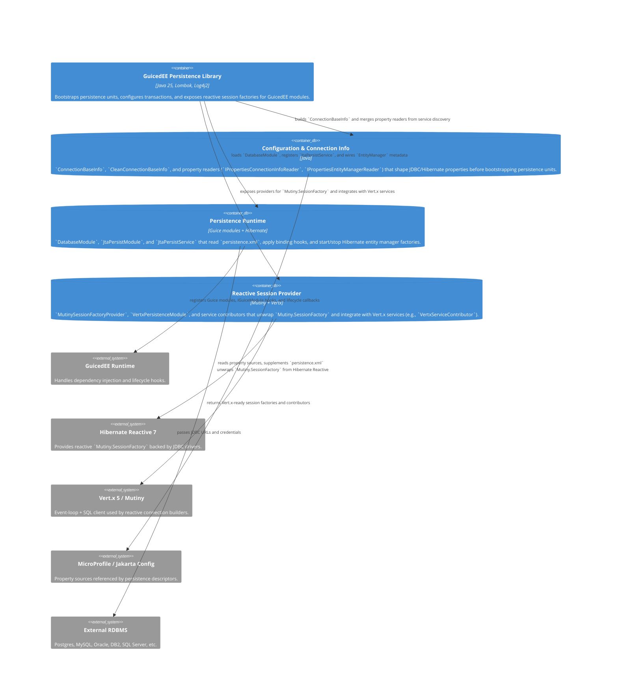

# C4 Level 2 — Container View

The persistence library breaks down into configuration helpers, runtime bridges, and reactive service providers. The following diagram summarizes the containers inside `com.guicedee.vertxpersistence` and how they interact with external runtimes.

Any implementation following this container map must keep these explicit responsibilities: configuration shaping, runtime bootstrapping, and reactive exposure.
