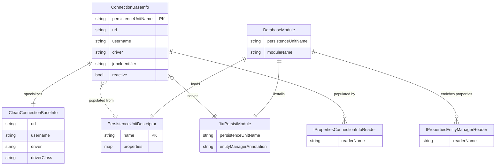

# ERD — Connection Configuration Domain

The core domain revolves around connection metadata readers, persistence descriptors, and the resultant Hibernate/Mutiny wiring.

The ERD identifies the persistence module database module as the entry point (`DatabaseModule` reads `PersistenceUnitDescriptor`), how property readers feed `ConnectionBaseInfo`, and how `JtaPersistModule` consumes the enriched metadata.
