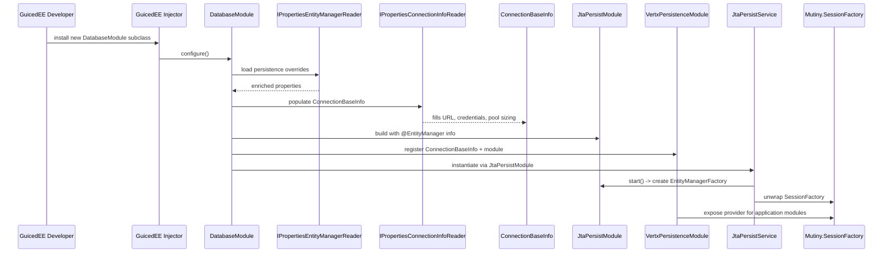

# Sequence — Persistence Module Bootstrap

This flow tracks how GuicedEE loads `DatabaseModule`, enriches persistence settings, and starts the underlying `Mutiny.SessionFactory` via `JtaPersistService`.

The sequence ensures each reader and module participates in the bootstrapping handshake before the reactive session factory becomes available to applications.
