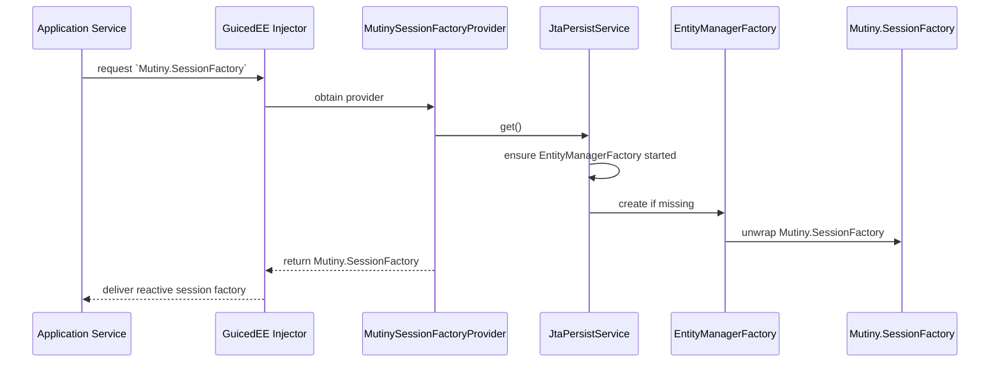

# Sequence — Reactive Session Factory Resolution

Once the persistence module is bootstrapped, application services request a `Mutiny.SessionFactory`. This sequence shows how Guice, `MutinySessionFactoryProvider`, and `JtaPersistService` coordinate the reactive factory lookup.

This sequence highlights the lazy-start semantics in `JtaPersistService` and the Guiced-enabled provider path for downstream services.
